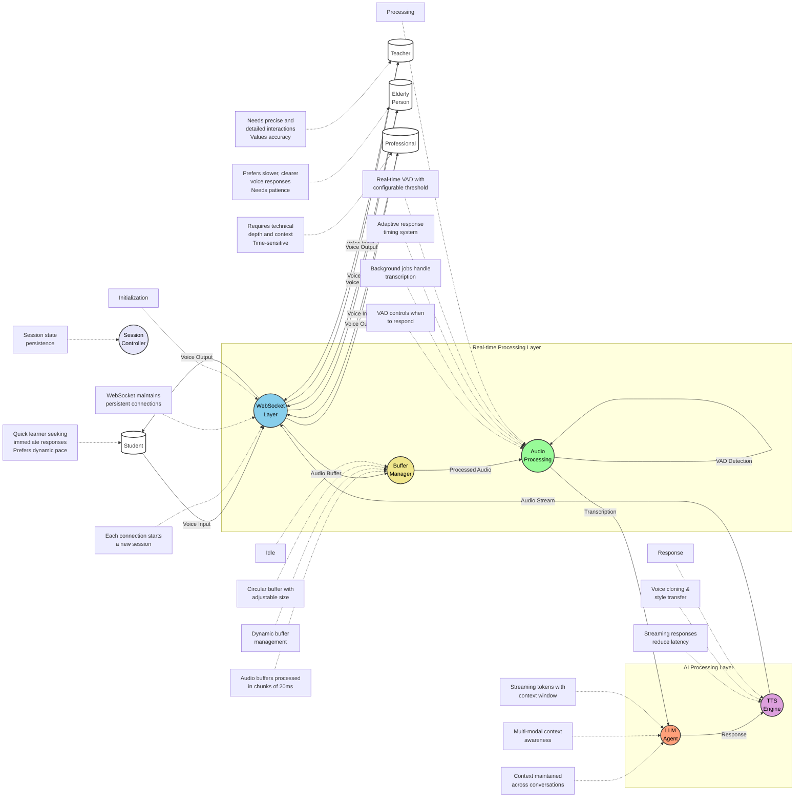

# 🦙 `echoOLlama`: Reverse-engineered OpenAI’s [Realtime API]
> 🌟 Talk to your local LLM models in human voice and get responses in realtime!


> ⚠️ **Active Development Alert!** ⚠️
>
> We're cooking up something amazing! While the core functionality is taking shape, some features are still in the oven. Perfect for experiments, but maybe hold off on that production deployment for now! 😉

## 🎯 What's `echoOLlama`?
`echoOLlama` is a cool project that lets you talk to AI models using your voice, just like you'd talk to a real person! 🗣️

Here's what makes it special:

- 🎤 You can speak naturally and the AI understands you
- 🤖 It works with local AI models (through Ollama) so your data stays private
- ⚡ Super fast responses in real-time
- 🔊 The AI talks back to you with a natural voice
- 🔄 Works just like OpenAI's API but with your own models

Think of it like having a smart assistant that runs completely on your computer. You can have natural conversations with it, ask questions, get help with tasks - all through voice! And because it uses local AI models, you don't need to worry about your conversations being stored in the cloud.

Perfect for developers who want to:
- Build voice-enabled AI applications
- Create custom AI assistants
- Experiment with local language models
- Have private AI conversations


### 🎉 What's Working Now:


- ✅ Connection handling and session management
- ✅ Real-time event streaming
- ✅ Redis-based session storage
- ✅ Basic database interactions
- ✅ OpenAI compatibility layer
- ✅ Core WebSocket infrastructure

### 🚧 On the Roadmap:
- 📝 Message processing pipeline (In Progress)
- 🤖 Advanced response generation with client events
- 🎯 Function calling implementation with client events
- 🔊 Audio transcription service connection with client events
- 🗣️ Text-to-speech integration with client events
- 📊 Usage analytics dashboard
- 🔐 Enhanced authentication system

## 🌟 Features & Capabilities

### 🎮 Core Services
- **Real-time Chat** 💬
  - Streaming responses via websockets
  - Multi-model support via Ollama
  - Session persistence
  - 🎤 Audio Transcription (FASTER_Whisper)
  - 🗣️ Text-to-Speech (OpenedAI/Speech)

- **Coming Soon** 🔜
  - 🔧 Function Calling System
  - 📊 Advanced Analytics

### 🛠️ Technical Goodies
- ⚡ Lightning-fast response times
- 🔒 Built-in rate limiting
- 📈 Usage tracking ready
- ⚖️ Load balancing for scale
- 🎯 100% OpenAI API compatibility

## 🏗️ System Architecture


## 💻 Tech Stack Spotlight
### 🎯 Backend Champions
- 🚀 FastAPI - Lightning-fast API framework
- 📝 Redis - Blazing-fast caching & session management
- 🐘 PostgreSQL - Rock-solid data storage

### 🤖 AI Powerhouse
- 🦙 Ollama - Local LLM inference
- 🎤 faster_whisper - Speech recognition (coming soon)
- 🗣️ OpenedAI TTS - Voice synthesis (coming soon)

## 🚀 Get Started in 3, 2, 1...

1. **Clone & Setup** 📦
```bash
git clone https://github.com/iamharshdev/EchoOLlama.git
cd EchoOLlama
python -m venv .venv
source .venv/bin/activate  # or `.venv\Scripts\activate` on Windows
pip install -r requirements.txt
```

2. **Environment Setup** ⚙️
```bash
cp .env.example .env
# Update .env with your config - check .env.example for all options!
make migrate # create db and apply migrations
```

3. **Launch Time** 🚀
```bash
# Fire up the services
docker-compose up -d

# Start the API server
uvicorn app.main:app --reload
```

## 🤝 Join the EchoOLlama Family
Got ideas? Found a bug? Want to contribute? Check out our [CONTRIBUTING.md](CONTRIBUTING.md) guide and become part of something awesome! We love pull requests! 🎉

## 💡 Project Status Updates
- 🟢 **Working**: Connection handling, session management, event streaming
- 🟡 **In Progress**: Message processing, response generation
- 🔴 **Planned**: Audio services, function calling, analytics

## 📜 License
MIT Licensed - Go wild! See [LICENSE](LICENSE) for the legal stuff.

---
*Built with 💖 by the community, for the community*

*PS: Star ⭐ us on GitHub if you like what we're building!*
