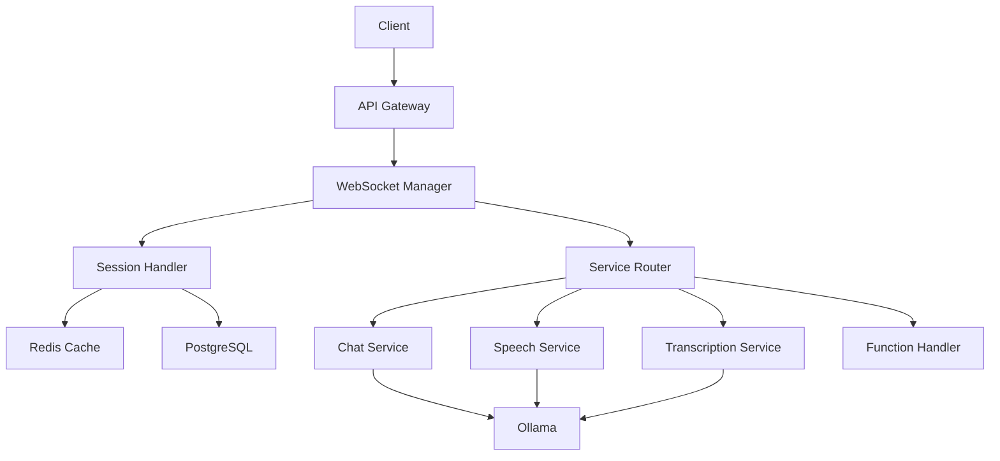

# 🦙 OLlamaGate: Your Open-Source Bridge to AI Power
> 🌟 Transform your local AI setup into an OpenAI-compatible powerhouse!


> ⚠️ **Active Development Alert!** ⚠️
> 
> We're cooking up something amazing! While the core functionality is taking shape, some features are still in the oven. Perfect for experiments, but maybe hold off on that production deployment for now! 😉

## 🎯 What's OLlamaGate?
Imagine having OpenAI's powerful API capabilities, but running entirely on your local machine! That's OLlamaGate - your open-source gateway to AI freedom. We're building a drop-in replacement for OpenAI's API suite, powered by Ollama and other awesome open-source tools.

### 🎉 What's Working Now:


- ✅ Connection handling and session management
- ✅ Real-time event streaming
- ✅ Redis-based session storage
- ✅ Basic database interactions
- ✅ OpenAI compatibility layer
- ✅ Core WebSocket infrastructure

### 🚧 On the Roadmap:
- 📝 Message processing pipeline (In Progress)
- 🤖 Advanced response generation with client events
- 🎯 Function calling implementation with client events
- 🔊 Audio transcription service connection with client events
- 🗣️ Text-to-speech integration with client events
- 📊 Usage analytics dashboard
- 🔐 Enhanced authentication system 

## 🌟 Features & Capabilities

### 🎮 Core Services
- **Real-time Chat** 💬
  - Streaming responses via websockets
  - Multi-model support via Ollama
  - Session persistence
  - 🎤 Audio Transcription (FASTER_Whisper)
  - 🗣️ Text-to-Speech (OpenedAI/Speech)

- **Coming Soon** 🔜
  - 🔧 Function Calling System
  - 📊 Advanced Analytics

### 🛠️ Technical Goodies
- ⚡ Lightning-fast response times
- 🔒 Built-in rate limiting
- 📈 Usage tracking ready
- ⚖️ Load balancing for scale
- 🎯 100% OpenAI API compatibility

## 🏗️ System Architecture


## 💻 Tech Stack Spotlight
### 🎯 Backend Champions
- 🚀 FastAPI - Lightning-fast API framework
- 📝 Redis - Blazing-fast caching & session management
- 🐘 PostgreSQL - Rock-solid data storage

### 🤖 AI Powerhouse
- 🦙 Ollama - Local LLM inference
- 🎤 faster_whisper - Speech recognition (coming soon)
- 🗣️ OpenedAI TTS - Voice synthesis (coming soon)

## 🚀 Get Started in 3, 2, 1...

1. **Clone & Setup** 📦
```bash
git clone https://github.com/iamharshdev/OLlamaGate.git
cd OLlamaGate
python -m venv .venv
source .venv/bin/activate  # or `.venv\Scripts\activate` on Windows
pip install -r requirements.txt
```

2. **Environment Setup** ⚙️
```bash
cp .env.example .env
# Update .env with your config - check .env.example for all options!
make migrate # create db and apply migrations
```

3. **Launch Time** 🚀
```bash
# Fire up the services
docker-compose up -d

# Start the API server
uvicorn app.main:app --reload
```

## 🤝 Join the OLlamaGate Family
Got ideas? Found a bug? Want to contribute? Check out our [CONTRIBUTING.md](CONTRIBUTING.md) guide and become part of something awesome! We love pull requests! 🎉

## 💡 Project Status Updates
- 🟢 **Working**: Connection handling, session management, event streaming
- 🟡 **In Progress**: Message processing, response generation
- 🔴 **Planned**: Audio services, function calling, analytics

## 📜 License
MIT Licensed - Go wild! See [LICENSE](LICENSE) for the legal stuff.

---
*Built with 💖 by the community, for the community*

*PS: Star ⭐ us on GitHub if you like what we're building!*
