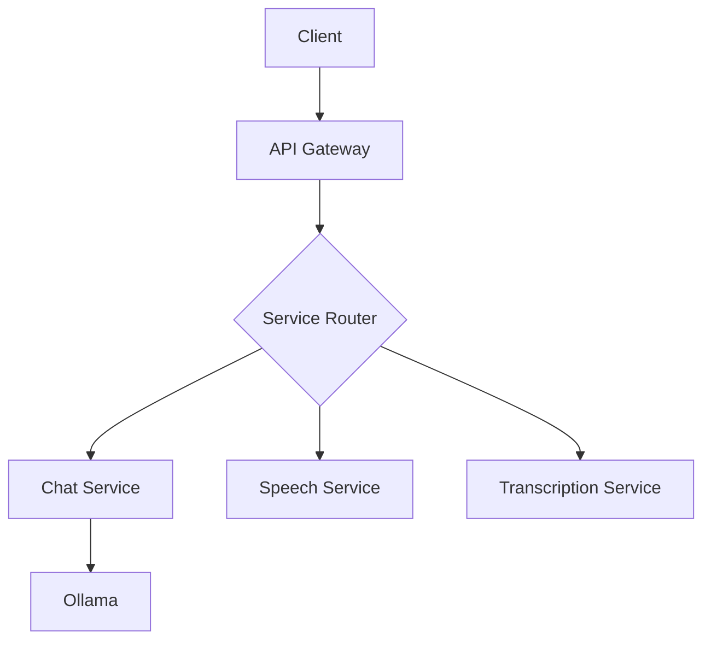

# 🦙 LlamaGate: A fusion of Ollama and OpenAI Gateway but open-source

> ⚠️ **WARNING: Work in Progress** ⚠️
> 
> This project is currently under active development and is not yet ready for production use. Features may be incomplete, unstable, or subject to significant changes. Use at your own risk.


## 🎯 Mission
🦙 LlamaGate is an open-source alternative to OpenAI's API suite, providing a unified interface for AI capabilities using Ollama and other open-source tools. It's designed to be a drop-in replacement for OpenAI's API, making it easy to switch from cloud-based to local AI solutions.

## 🌟 Features

### Core APIs
- **Chat Completions** - Real-time chat interactions using Ollama models with streaming support
- **Audio Transcription** - High-accuracy speech-to-text using Whisper.cpp locally
- **Text-to-Speech (TTS)** - Natural voice synthesis powered by Opened-Ai/Speech TTS engine
- **Function Calling** - Support for structured function calls and responses

### Technical Features
- 🔄 Streaming responses (SSE)
- 🔒 Rate limiting & authentication
- 📊 Usage tracking & analytics
- 🎯 Load balancing for multiple Ollama instances
- 🧪 100% API compatibility with OpenAI

## 🏗️ Architecture



## 💻 Tech Stack

### Backend
- FastAPI for API
- Redis for caching
- PostgreSQL for storage

### AI Components
- Ollama for LLM inference
- faster_whisper for transcription
- OpenedAI TTS for speech synthesis

## 🚀 Quick Start

1. Clone and Setup
```bash
git clone https://github.com/iamharshdev/🦙 LlamaGate.git
cd 🦙 LlamaGate
python -m venv .venv
source .venv/bin/activate
pip install -r requirements.txt
```

2. Environment Configuration
```bash
cp .env.example .env
# Configure your environment variables
```

3. Run Services
```bash
docker-compose up -d  # Starts Ollama, Redis, and PostgreSQL
uvicorn app.main:app --reload  # Starts the FastAPI server
```

## 🤝 Contributing
Please read our [CONTRIBUTING.md](CONTRIBUTING.md) for details on our code of conduct and the process for submitting pull requests.

## 📜 License
This project is licensed under the MIT License - see the [LICENSE](LICENSE) file for details.

---

*Built with 💻 by the open-source community*